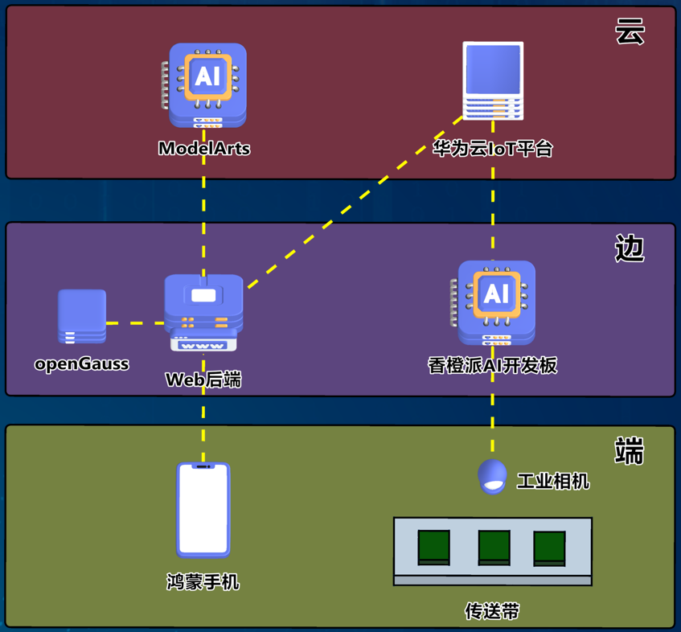
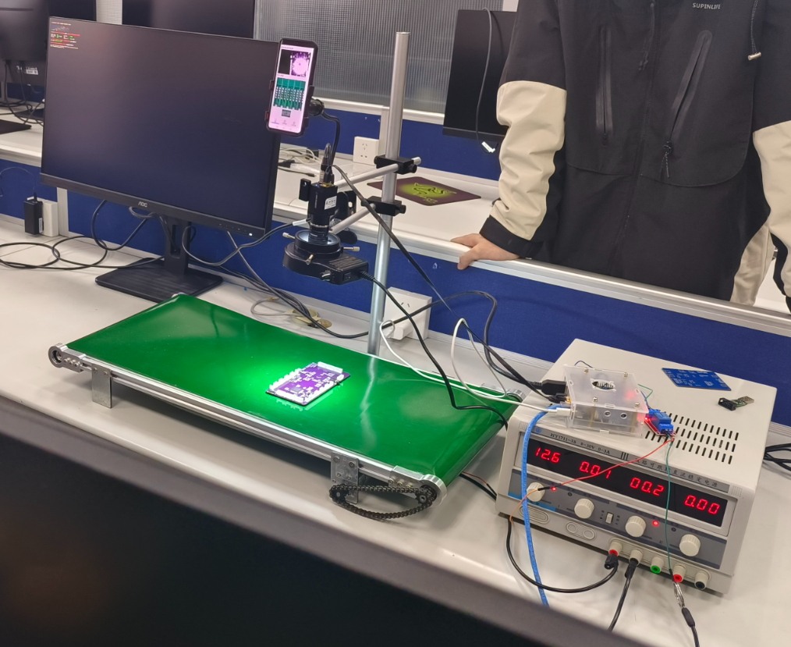

# 拔萝卜的工程队
### 第十九届“挑战杯”揭榜挂帅专项赛华为赛道打榜第一&amp;国家特等奖-拔萝卜的工程队作品仓库 
## 作品简介
一套流水线PCB瑕疵检测方案，包含模型、鸿蒙APP、后端、板端、NPU训练、数据集处理六大模块。 

## 作品介绍（括号外的为我们的答辩稿）  
习总书记强调，发展新质生产力是推动高质量发展的内在要求和重要着力点。PCB板作为电子器件的关键支撑体，其瑕疵检测是赋能新质生产力的重要力量。现有检测方案主要为人工质检和AOI检测，仍有不足之处。为此，华为赛方提出了一套基于yolov5模型的人工智能瑕疵检测方案，然而，其仍然面临数据缺乏、模型落后、昇腾适配弱、鸿蒙检测模式自动化低四大挑战。为此，我们给出解决方案，对数据集正类增强、负类对抗；进行模型改进、参数优化；NPU迁移分析、精准调优；APP拓展鸿蒙，功能完整。最终模型在本赛道复赛打榜中**排名第一**。  
### 数据集  
我们将现有小样本数据集切分成多个子图（不同子图之间有10%重叠率），并对每个子图进行颜色变换、噪声干扰、缩放拉伸（还有旋转、亮度对比度调整），同时保留无瑕PCB子图进行对抗，扩充数据集至150倍（约9000张，大小为512*512）。解决少样本问题，map50-95 指标超越复赛各队平均成绩**50%**(0.4605)，位列第一。 
### 模型  
我们基于yolov9-e，优化损失函数（Inner-EIoU），添加小目标下采样层（ADown），解决了小目标问题。通过采用onnx存储参数，添加辅助信息，峰值负载下降**44%**（14G->8G），大量节省计算资源。  
### 昇腾NPU  
我们基于自动迁移，使用Ascend Pytorch Profiler分析训练，根据分析结果采用多种调优策略（升级高性能库、使用锁页内存、NPU亲和优化器、非阻塞数据下发、算子二进制调优、NPU亲和API扫描）。解决了迁移适配弱问题，相较优化前训练加速比达**1.5**（240s/ep->160s/ep，同时解决了NPU训练初期梯度爆炸问题），大幅降低训练耗时。  
### 鸿蒙APP+流水线模型  
鸿蒙APP方面，我们基于真机开发，采用**全国产化软硬件和华为生态**（华为云ModelArts、华为云IOT平台、openGauss数据库、鸿蒙真机开发、香橙派AI开发板、海康威视工业相机），在完成赛方要求的手持拍照检测功能基础上，利用华为IOT平台，创新性的联动鸿蒙手机与流水线，实现PCB瑕疵检测高度自动化。  

  

数字信息化时代背景下，中国仍然是全球最大的PCB生产基地，庞大的PCB生产规模为PCB瑕疵检测提供了巨大的市场容量。
我们的项目经过华工激光应用评估，得到长江学者特聘教授金海推荐，体现了项目的应用价值和研发潜力。  
团队介绍方面。团队由何琨教授与欧阳由工程师指导。团队成员均为本科生，不仅在本赛道复赛打榜第一、展现了专业的技术水平，还具有显著的发展潜力。团队计划继续探索瑕疵检测领域，应用华为生态，基于昇腾NPU继续改进瑕疵检测算法，进一步完善自动化部署服务。本团队希望与华为深度合作，推广瑕疵检测技术在生产线上的应用。  
**总而言之，我们为企业量身定制了一套全国产化的流水线PCB质检方案，在华为ModelArts上实现YOLOv9算法迁移分析调优，利用NPU训练出最佳模型。通过华为云IOT平台，联系了鸿蒙APP和流水线模型，助力制造业数智化创新，为新质生产力贡献青春力量。**

## 项目贡献者
特别鸣谢：  
华中科技大学计算机科学与技术学院 谭志虎院长；  
华中科技大学计算机科学与技术学院团委 程志强老师；  
毕业老登 张恭博学长 及[其领导的项目团队](https://github.com/Nobody-Zhang/huaweicloud_2023)  
指导老师：  
华中科技大学计算机科学与技术学院教授，AIπ团队指导老师 何琨老师；  
华中科技大学计算机科学与技术学院双创中心负责人 欧阳由老师；  
参赛队员：  
赖永烨，陈薛嘉，唐锐，郭奕辰，徐战潮，狄桓炜，赵亦安，代镇瀚，廖思明，王昕瑞  
协作者：  
陈雨辛，刘定蔼，刘俊德，刘世峰，蓝松，赵少敏，林绮涵，甘书辞  

## 联系我们
如果希望获取本项目的答辩PPT，或者希望交流挑战杯比赛心得，可以通过loyingue@qq.com联系团队。  

